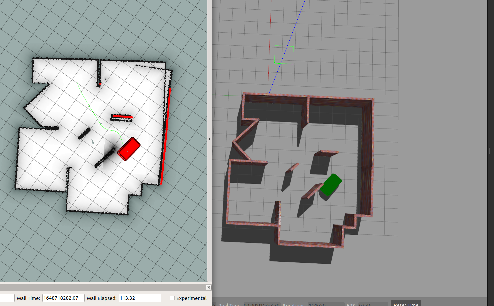

# Gazebo_move_base
 
# Panthera Gazebo Simulation

ROS packages for simulating Panthera robot using Gazebo Simulator. We provides several environment worlds to test the robot. 

## Dependencies

Make sure you have ROS melodic installed, Tested in Ros noetic. Although other ros-distros might also work. This simualtion package also relies on the following external packages, so make sure you have installed everything from source before building this package.

## Build from source


```
cd <ros1_ws>/src
git clone https://github.com/roarLab/panthera_v3_simulation
sudo apt-get install ros-melodic-navigation ros-melodic-ros-control ros-melodic-velocity-controllers ros-melodic-position-controllers

cd ..
rosdep install -y --from-paths src --ignore-src --rosdistro <YOUR_ROS_DISTRO>
catkin_make
```
## Give permission to executable files

```

cd <ros1_ws>/src/panthera_v3_simulation/Gazebo_move_base/panthera_move_base/src
chmod 777 *

```


## Simulate panthera in small room-like environment

```
cd <ros1_ws>
source devel/setup.bash
roslaunch panthera_gazebo panthera_small_room_V3.launch
```

## Run the odom

```
cd <ros1_ws>
source devel/setup.bash
rosrun panthera_move_base odom_pub_tf.py
```

## Run the inverse kinematics

```
cd <ros1_ws>
source devel/setup.bash
rosrun panthera_move_base panthera_inverse_kinematics.py
```

## Run the Move Base , AMCL and Map loader

```
cd <ros1_ws>
source devel/setup.bash
roslaunch panthera_move_base panthera_navigation.launch
```


